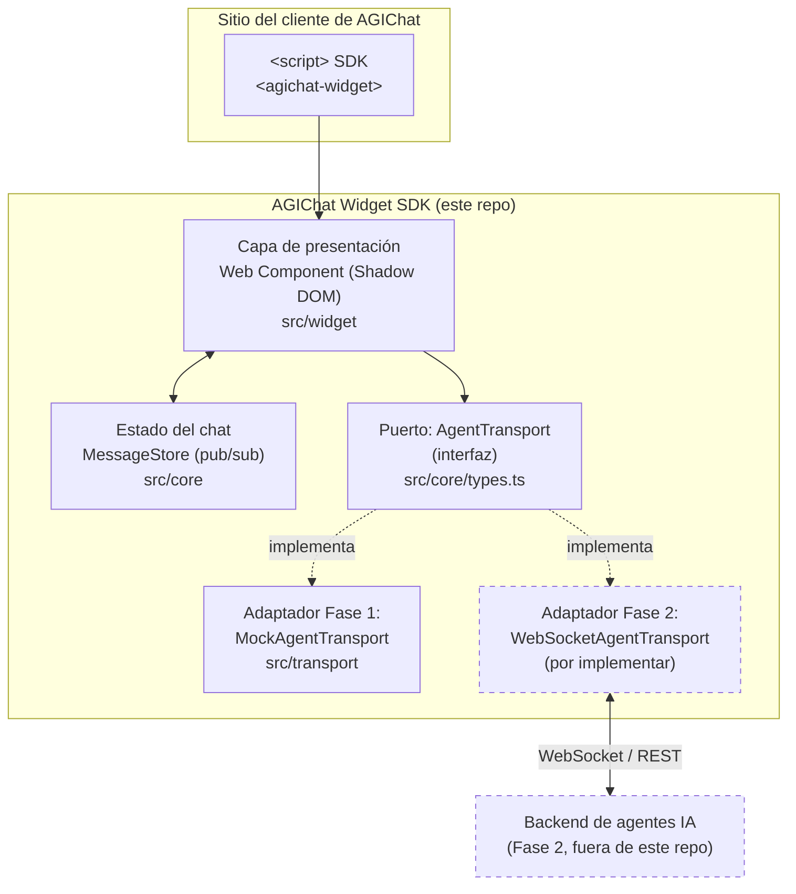
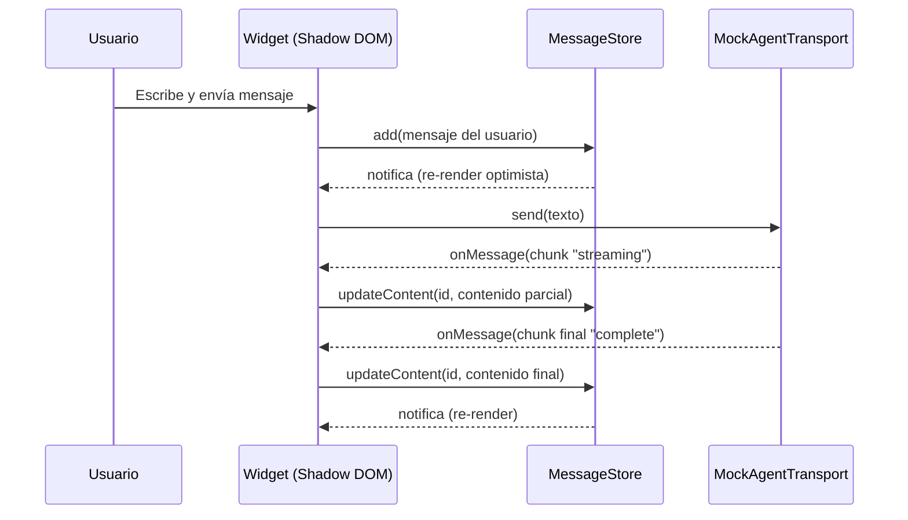

# AGIChat Widget SDK

SDK embebible de un widget de chat que permite a los clientes de **AGIChat** añadir una
interfaz agéntica a su sitio web con una sola línea de integración. Este repositorio
corresponde a la **Fase 1** del proyecto: la interfaz está completa y conectada a un
transporte simulado (mock), lista para que en la **Fase 2** se conecte a un agente real
sin cambios en la capa visual.

## Tabla de contenido

- [Arquitectura](#arquitectura)
- [Estructura de carpetas](#estructura-de-carpetas)
- [Cómo correr el proyecto](#cómo-correr-el-proyecto)
- [Calidad, tests y cobertura](#calidad-tests-y-cobertura)
- [CI/CD](#cicd)
- [Estrategia de ramas: GitHub Flow](#estrategia-de-ramas-github-flow)
- [Plan de trabajo (Parte 1 / Parte 2)](#plan-de-trabajo-parte-1--parte-2)
- [Herramientas agénticas](#herramientas-agénticas)

## Arquitectura

### Decisión y justificación

Se eligió una arquitectura de **capas con puertos y adaptadores (hexagonal simplificada)**,
implementada como un **Web Component nativo** (Custom Element + Shadow DOM), por las
siguientes razones:

1. **Es un SDK, no una app**: los clientes de Maxine usan stacks distintos (React, Vue,
   WordPress, HTML plano). Un Custom Element funciona igual en cualquiera de ellos con
   una sola etiqueta `<agichat-widget>`, sin forzar un framework ni generar conflictos de
   estilos gracias al Shadow DOM.
2. **El agente real todavía no existe**: la UI nunca habla directamente con una API o un
   WebSocket. Habla con una interfaz `AgentTransport` (el "puerto"). Hoy esa interfaz la
   implementa `MockAgentTransport` (el "adaptador" simulado); en la Fase 2 se agrega un
   adaptador real (p. ej. `WebSocketAgentTransport`) y el widget no se toca.
3. **Testabilidad y cobertura**: separar estado (`MessageStore`), transporte
   (`AgentTransport`) y presentación (Custom Element) permite probar la lógica de negocio
   sin DOM y llegar cómodamente al 80% de cobertura exigido.



**Cómo se lee el diagrama:** todo lo que está dentro de "AGIChat Widget SDK" se entrega en
esta fase. Lo punteado (`WebSocketAgentTransport` y el backend de agentes) es el trabajo de
la Fase 2 del curso: se implementa un nuevo adaptador que cumple el mismo contrato
`AgentTransport`, se inyecta en el widget (`el.transport = new WebSocketAgentTransport(...)`)
y todo lo demás sigue funcionando sin cambios.

### Flujo de un mensaje (mock actual)



## Estructura de carpetas

```
.
├── .github/
│   ├── workflows/ci.yml       # Pipeline de CI: lint, formato, typecheck, tests, build
│   └── PULL_REQUEST_TEMPLATE.md
├── src/
│   ├── core/                  # Lógica de dominio, agnóstica de DOM y de transporte
│   │   ├── types.ts           # Tipos compartidos (ChatMessage, AgentTransport, ...)
│   │   ├── id.ts               # Generador de ids de mensaje
│   │   └── message-store.ts   # Estado del chat (pub/sub), con sus tests
│   ├── transport/              # Adaptadores del puerto AgentTransport
│   │   └── mock-transport.ts  # Adaptador simulado (Fase 1)
│   ├── widget/                 # Capa de presentación (Web Component)
│   │   └── agichat-widget.ts  # Custom Element <agichat-widget>
│   └── index.ts                # Punto de entrada público del SDK
├── AGENTS.md                   # Guía para herramientas de codeo agéntico
├── README.md                   # Este documento
├── vite.config.ts              # Build (modo librería) + configuración de Vitest/cobertura
├── eslint.config.js
└── package.json
```

### Cómo debe escalar el proyecto

- **Nuevas implementaciones de transporte** (Fase 2, agente real, reconexión, auth, etc.)
  van en `src/transport/`, cada una como un archivo nuevo que implementa `AgentTransport`.
  No se modifica `src/widget/` para soportarlas: solo se inyecta la instancia.
- **Nuevos subcomponentes visuales** (burbuja de mensaje, indicador de "escribiendo",
  renderizado de Markdown, temas) van en `src/widget/components/` a medida que el widget
  crezca; hoy vive todo en un único archivo porque el alcance de la Fase 1 es mínimo.
- **Lógica de dominio nueva** (por ejemplo, persistencia local del historial, límites de
  mensajes, adjuntos) va en `src/core/`, siempre sin importar nada de `src/widget/` para
  mantenerla testeable sin DOM.
- **Ejemplos de integración** (HTML plano, React, Vue) deberían vivir en una carpeta
  `examples/` cuando se necesiten, sin afectar el build del paquete publicado (`dist/`).
- Cada módulo nuevo debe llegar con su archivo `*.test.ts` junto al código, siguiendo el
  patrón ya usado en `src/core` y `src/transport`.

## Cómo correr el proyecto

Este proyecto usa **pnpm** (no `npm` ni `yarn`) como gestor de paquetes. pnpm bloquea por
defecto los scripts `postinstall` de dependencias transitivas hasta que se aprueban
explícitamente (`pnpm approve-builds`), lo que reduce el riesgo de ataques a la cadena de
suministro vía `npm install`.

```bash
corepack enable                 # o: npm install -g pnpm
pnpm install

pnpm dev                        # servidor de desarrollo (Vite)
pnpm build                      # build de producción del SDK a dist/
pnpm test                       # tests una vez
pnpm test:watch                 # tests en modo watch
pnpm test:coverage              # tests + reporte de cobertura
pnpm lint                       # ESLint
pnpm format                     # Prettier (escribe cambios)
pnpm format:check               # Prettier (solo verifica)
pnpm typecheck                  # TypeScript sin emitir archivos
```

### Uso del widget (integración de referencia)

```html
<script type="module" src="https://cdn.example.com/agichat-widget-sdk.js"></script>
<agichat-widget></agichat-widget>
```

El widget se conecta de forma perezosa (lazy): el transporte mock recién se activa cuando
el usuario abre el panel de chat por primera vez.

## Calidad, tests y cobertura

- Framework de pruebas: **Vitest** con entorno `jsdom` para las pruebas del Custom Element.
- El umbral mínimo de cobertura (**80%** en líneas, funciones, ramas y statements) está
  configurado en [`vite.config.ts`](./vite.config.ts) bajo `test.coverage.thresholds` y se
  hace cumplir automáticamente: `pnpm test:coverage` falla si no se alcanza.
- Estado actual: 100% en líneas/funciones/statements sobre `src/core`, `src/transport` y
  `src/widget` (ver salida de `pnpm test:coverage`).

## CI/CD

El pipeline en [`.github/workflows/ci.yml`](./.github/workflows/ci.yml) corre en cada Pull
Request hacia `main` y en cada push a `main`. Pasos:

1. Instalación de dependencias con pnpm (`--frozen-lockfile`, reproducible).
2. **Lint** (ESLint) — condición explícita pedida por Maxine para asegurar un estilo de
   código consistente entre colaboradores.
3. Verificación de formato (Prettier).
4. Typecheck (TypeScript, sin emitir).
5. Tests con cobertura (falla si baja del 80%).
6. Build del paquete distribuible.

Un PR no debería poder fusionarse a `main` si alguno de estos pasos falla (configurar esto
como _required status check_ en la protección de la rama `main` en GitHub, desde
Settings → Branches — paso manual que debe hacer quien administre el repositorio).

## Estrategia de ramas: GitHub Flow

1. `main` siempre debe quedar en estado desplegable.
2. Para cualquier cambio se crea una rama corta desde `main`: `feat/<algo>`, `fix/<algo>`,
   `docs/<algo>`, `chore/<algo>`.
3. Se abre un Pull Request tan pronto como sea útil recibir feedback (no hace falta esperar
   a que el trabajo esté terminado).
4. El pipeline de CI debe pasar en el PR.
5. **Se requiere al menos una revisión (PR review) de otra persona del equipo** antes de
   poder fusionar — así lo pidió explícitamente Maxine.
6. Al fusionar (squash merge recomendado) se elimina la rama.
7. Cualquier commit en `main` es, en teoría, desplegable de inmediato.

## Plan de trabajo (Parte 1 / Parte 2)

El equipo se dividió en dos partes secuenciales para que una persona/subgrupo termine la
Parte 1 y la entregue lista para que otra persona/subgrupo continúe con la Parte 2, sin
bloquearse mutuamente.

### Parte 1 — Fundaciones, contrato y CI/CD (este entregable)

- [x] Scaffolding del proyecto (TypeScript + Vite en modo librería + pnpm).
- [x] Lint (ESLint) + formato (Prettier) + typecheck configurados y en verde.
- [x] Capa `core`: tipos compartidos, `MessageStore` (estado pub/sub) con tests.
- [x] Capa `transport`: contrato `AgentTransport` + `MockAgentTransport` (simulación de un
      agente con streaming palabra por palabra y respuesta de ejemplo en Markdown) con
      tests.
- [x] Widget mínimo funcional (`<agichat-widget>`): abre/cierra panel, conecta el
      transporte de forma perezosa, envía mensajes del usuario y renderiza las respuestas
      del mock en tiempo real, con tests.
- [x] Cobertura de tests ≥ 80% (actualmente 100% en los módulos de esta entrega).
- [x] Pipeline de CI/CD en GitHub Actions (lint, formato, typecheck, test+cobertura, build).
- [x] Plantilla de Pull Request para forzar el flujo de revisión grupal.
- [x] Documentación: este README (arquitectura + estructura de carpetas) y `AGENTS.md`.

### Parte 2 — Experiencia visual, Markdown y empaquetado final (siguiente entregable)

A cargo de la siguiente persona/subgrupo, partiendo de esta base sin romper el contrato
`AgentTransport` ni el pipeline de CI existente:

- [ ] Implementar el diseño visual definitivo del widget según el wireframe de Maxine
      (paleta de colores y estilos a libre elección del equipo), reemplazando los estilos
      mínimos actuales en `src/widget/agichat-widget.ts` (o dividiéndolo en
      `src/widget/components/`).
- [ ] Renderizado de **Markdown** de los mensajes del agente (la respuesta simulada de
      `MockAgentTransport` ya incluye Markdown de ejemplo — negritas, listas y bloques de
      código — pensado para probar esto) con sanitización del HTML resultante.
- [ ] Estados de UX adicionales: indicador de "escribiendo…", errores de conexión,
      reintentos, mensajes vacíos/placeholder.
- [ ] Accesibilidad (foco al abrir el panel, navegación por teclado, roles ARIA revisados).
- [ ] Ampliar la suite de tests para los nuevos componentes visuales, manteniendo la
      cobertura global ≥ 80%.
- [ ] Ejemplos de integración (`examples/`) para HTML plano, React y/o Vue.
- [ ] Preparar el empaquetado final para distribución (versión de `package.json`, changelog
      inicial, revisión de tamaño de bundle).
- [ ] (Fase 2 del curso, no de esta Parte 2) Implementar `WebSocketAgentTransport` (u
      equivalente) que cumpla la interfaz `AgentTransport` para conectar con el agente real.

## Herramientas agénticas

Ver [`AGENTS.md`](./AGENTS.md) para las convenciones que debe seguir cualquier herramienta
de codeo agéntico (Claude Code, GitHub Copilot, Cursor, etc.) al generar código en este
repositorio.
