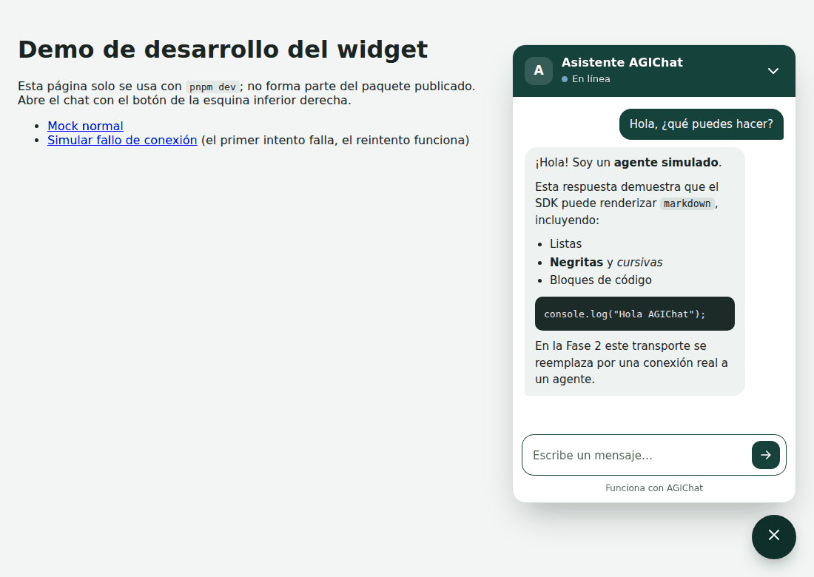
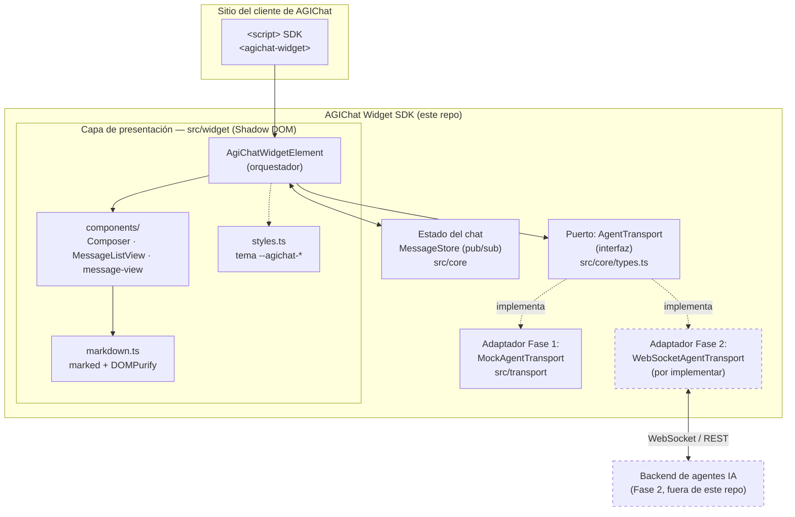
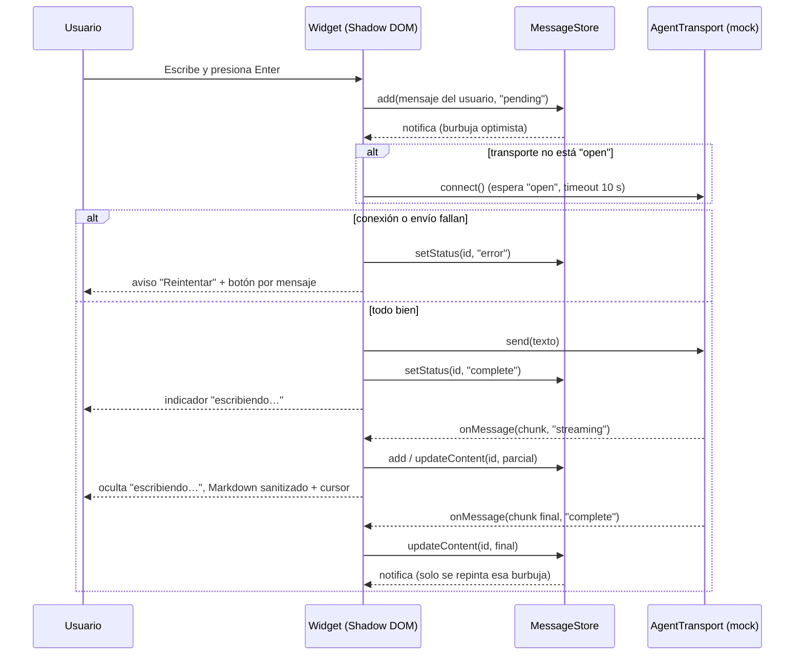
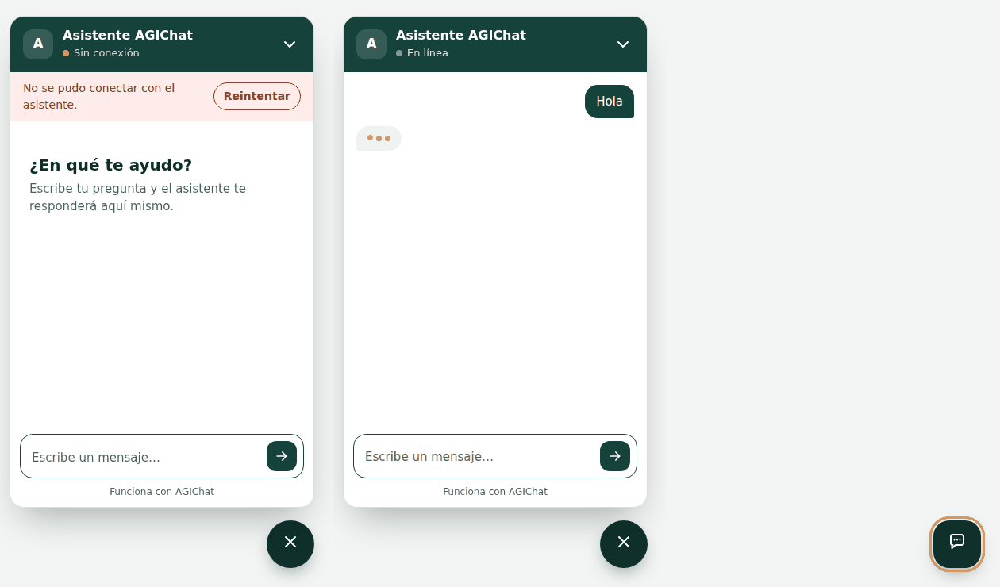
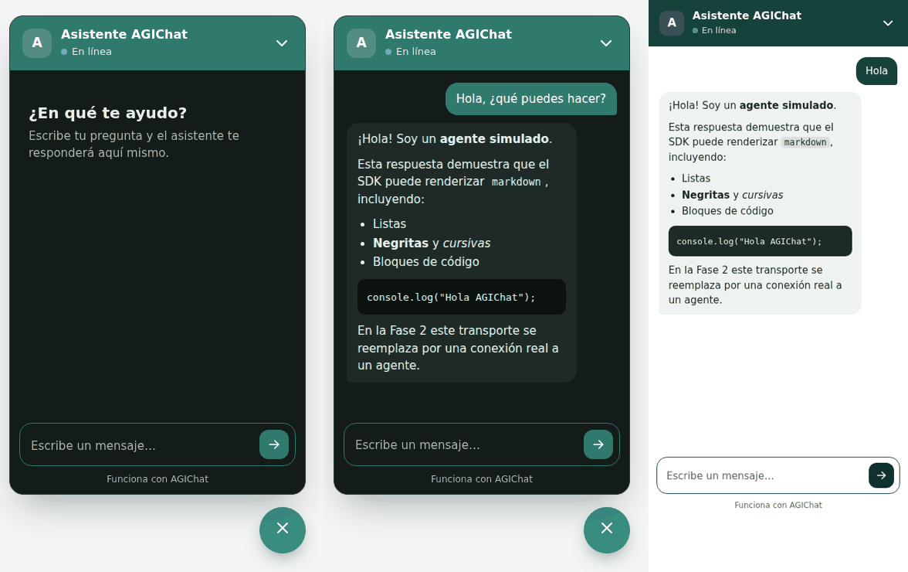

# AGIChat Widget SDK

SDK embebible de un widget de chat que permite a los clientes de **AGIChat** añadir una
interfaz agéntica a su sitio web con una sola línea de integración. Este repositorio
corresponde a la **Fase 1** del proyecto: la interfaz está completa y conectada a un
transporte simulado (mock), lista para que en la **Fase 2** se conecte a un agente real
sin cambios en la capa visual.



## Tabla de contenido

- [Arquitectura](#arquitectura)
- [Estructura de carpetas](#estructura-de-carpetas)
- [Cómo correr el proyecto](#cómo-correr-el-proyecto)
- [Uso del widget](#uso-del-widget)
- [Calidad, tests y cobertura](#calidad-tests-y-cobertura)
- [CI/CD](#cicd)
- [Estrategia de ramas: GitHub Flow](#estrategia-de-ramas-github-flow)
- [Plan de trabajo (Parte 1 / Parte 2)](#plan-de-trabajo-parte-1--parte-2)
- [Decisiones de la Parte 2](#decisiones-de-la-parte-2)
- [Herramientas agénticas](#herramientas-agénticas)

## Arquitectura

### Decisión y justificación

Se eligió una arquitectura de **capas con puertos y adaptadores (hexagonal simplificada)**,
implementada como un **Web Component nativo** (Custom Element + Shadow DOM), por las
siguientes razones:

1. **Es un SDK, no una app**: los clientes de Maxine usan stacks distintos (React, Vue,
   WordPress, HTML plano). Un Custom Element funciona igual en cualquiera de ellos con
   una sola etiqueta `<agichat-widget>`, sin forzar un framework ni generar conflictos de
   estilos gracias al Shadow DOM.
2. **El agente real todavía no existe**: la UI nunca habla directamente con una API o un
   WebSocket. Habla con una interfaz `AgentTransport` (el "puerto"). Hoy esa interfaz la
   implementa `MockAgentTransport` (el "adaptador" simulado); en la Fase 2 se agrega un
   adaptador real (p. ej. `WebSocketAgentTransport`) y el widget no se toca.
3. **Testabilidad y cobertura**: separar estado (`MessageStore`), transporte
   (`AgentTransport`) y presentación (Custom Element) permite probar la lógica de negocio
   sin DOM y llegar cómodamente al 80% de cobertura exigido.



**Cómo se lee el diagrama:** todo lo que está dentro de "AGIChat Widget SDK" se entrega en
esta fase. Lo punteado (`WebSocketAgentTransport` y el backend de agentes) es el trabajo de
la Fase 2 del curso: se implementa un nuevo adaptador que cumple el mismo contrato
`AgentTransport`, se inyecta en el widget (`el.transport = new WebSocketAgentTransport(...)`)
y todo lo demás sigue funcionando sin cambios.

### Flujo de un mensaje (mock actual)



## Estructura de carpetas

```
.
├── .github/
│   ├── workflows/
│   │   ├── ci.yml             # CI: lint, formato, typecheck, tests+cobertura, build, tamaño
│   │   └── release.yml        # CD: GitHub Release al empujar un tag vX.Y.Z
│   └── PULL_REQUEST_TEMPLATE.md
├── docs/capturas/             # Capturas del widget usadas en este README
├── examples/                  # Integraciones de referencia (no se publican)
│   ├── html/                  # HTML plano, sin build
│   ├── react/                 # Componente envoltorio para React
│   └── vue/                   # Componente envoltorio para Vue 3
├── scripts/
│   └── check-bundle-size.mjs  # Presupuesto de tamaño del bundle (pnpm size)
├── src/
│   ├── core/                  # Lógica de dominio, agnóstica de DOM y de transporte
│   │   ├── types.ts           # Tipos compartidos (ChatMessage, AgentTransport, ...)
│   │   ├── id.ts              # Generador de ids de mensaje
│   │   └── message-store.ts   # Estado del chat (pub/sub)
│   ├── transport/             # Adaptadores del puerto AgentTransport
│   │   └── mock-transport.ts  # Adaptador simulado (Fase 1)
│   ├── widget/                # Capa de presentación (Web Component)
│   │   ├── agichat-widget.ts  # Custom Element <agichat-widget>: orquesta todo lo demás
│   │   ├── components/        # Subcomponentes visuales
│   │   │   ├── composer.ts        # Caja de texto (Enter / Shift+Enter, auto-altura)
│   │   │   ├── message-list.ts    # Lista de mensajes con reconciliación por id y auto-scroll
│   │   │   └── message-view.ts    # Una burbuja: texto o Markdown, estados y reintento
│   │   ├── connection-state.ts # Textos de estado y aviso de conexión
│   │   ├── markdown.ts        # Markdown -> HTML sanitizado (marked + DOMPurify)
│   │   ├── styles.ts          # Hoja de estilos y tema (--agichat-*)
│   │   └── icons.ts           # Íconos SVG en línea
│   └── index.ts               # Punto de entrada público del SDK
├── index.html                 # Página de demo para `pnpm dev` (no se publica)
├── AGENTS.md                  # Guía para herramientas de codeo agéntico
├── CHANGELOG.md               # Historial de versiones
├── README.md                  # Este documento
├── vite.config.ts             # Build (modo librería) + configuración de Vitest/cobertura
├── eslint.config.js
└── package.json
```

Cada archivo `.ts` de `src/` tiene su `*.test.ts` al lado.

### Cómo debe escalar el proyecto

- **Nuevas implementaciones de transporte** (Fase 2, agente real, reconexión, auth, etc.)
  van en `src/transport/`, cada una como un archivo nuevo que implementa `AgentTransport`.
  No se modifica `src/widget/` para soportarlas: solo se inyecta la instancia.
- **Nuevos subcomponentes visuales** (adjuntos, botones de sugerencia, valoración de
  respuestas, etc.) van en `src/widget/components/`, un archivo por componente con su test.
  El Custom Element (`agichat-widget.ts`) solo los instancia y conecta con el estado y el
  transporte; la lógica de cada pieza no debe vivir ahí.
- **Estilos**: todo color, radio o tipografía nueva se declara como custom property
  `--agichat-*` en `styles.ts` (con su variante para modo oscuro), para que los clientes
  puedan tematizar el widget sin tocar el código.
- **Lógica de dominio nueva** (por ejemplo, persistencia local del historial, límites de
  mensajes, adjuntos) va en `src/core/`, siempre sin importar nada de `src/widget/` para
  mantenerla testeable sin DOM.
- **Ejemplos de integración** para otros stacks (Angular, Svelte, WordPress) van en una
  subcarpeta nueva de `examples/`, sin afectar el build del paquete publicado (`dist/`).
- Cada módulo nuevo debe llegar con su archivo `*.test.ts` junto al código, siguiendo el
  patrón ya usado en `src/core` y `src/transport`.

## Cómo correr el proyecto

Este proyecto usa **pnpm** (no `npm` ni `yarn`) como gestor de paquetes. pnpm bloquea por
defecto los scripts `postinstall` de dependencias transitivas hasta que se aprueban
explícitamente (`pnpm approve-builds`), lo que reduce el riesgo de ataques a la cadena de
suministro vía `npm install`.

```bash
corepack enable                 # o: npm install -g pnpm
pnpm install

pnpm dev                        # demo en http://localhost:5173 (?fallo=1 simula un error)
pnpm build                      # build de producción del SDK a dist/
pnpm size                       # verifica el presupuesto de tamaño del bundle
pnpm test                       # tests una vez
pnpm test:watch                 # tests en modo watch
pnpm test:coverage              # tests + reporte de cobertura
pnpm lint                       # ESLint
pnpm format                     # Prettier (escribe cambios)
pnpm format:check               # Prettier (solo verifica)
pnpm typecheck                  # TypeScript sin emitir archivos
```

## Uso del widget

```html
<script type="module" src="https://cdn.example.com/agichat-widget-sdk.js"></script>
<agichat-widget agent-name="Soporte Tienda"></agichat-widget>
```

El widget se conecta de forma perezosa (lazy): el transporte recién se activa cuando el
usuario abre el panel por primera vez (o envía su primer mensaje).

| API                                            | Descripción                                                      |
| ---------------------------------------------- | ---------------------------------------------------------------- |
| `agent-name`, `welcome-message`, `placeholder` | Atributos de texto (tienen valores por defecto en español)       |
| `position="bottom-left"`                       | Lanzador a la izquierda (por defecto, a la derecha)              |
| `el.transport = miTransporte`                  | Inyecta cualquier `AgentTransport`, antes o después de montar    |
| `openPanel()`, `closePanel()`, `toggle()`      | Control programático del panel; `el.open` indica si está abierto |
| `agichat-open`, `agichat-close`                | Eventos que burbujean fuera del Shadow DOM                       |
| `--agichat-primary`, `--agichat-surface`, …    | Custom properties para el tema (lista en `src/widget/styles.ts`) |

Ejemplos completos para HTML plano, React y Vue en [`examples/`](./examples/).





## Calidad, tests y cobertura

- Framework de pruebas: **Vitest** con entorno `jsdom` para las pruebas del Custom Element.
- El umbral mínimo de cobertura (**80%** en líneas, funciones, ramas y statements) está
  configurado en [`vite.config.ts`](./vite.config.ts) bajo `test.coverage.thresholds` y se
  hace cumplir automáticamente: `pnpm test:coverage` falla si no se alcanza.
- Estado actual (v1.0.0): 98 tests; 100 % de líneas, funciones y statements y ~99 % de
  ramas sobre `src/core`, `src/transport`, `src/widget` y `src/widget/components` (ver
  salida de `pnpm test:coverage`).

## CI/CD

El pipeline en [`.github/workflows/ci.yml`](./.github/workflows/ci.yml) corre en cada Pull
Request hacia `main` y en cada push a `main`. Pasos:

1. Instalación de dependencias con pnpm (`--frozen-lockfile`, reproducible).
2. **Lint** (ESLint) — condición explícita pedida por Maxine para asegurar un estilo de
   código consistente entre colaboradores.
3. Verificación de formato (Prettier).
4. Typecheck (TypeScript, sin emitir).
5. Tests con cobertura (falla si baja del 80%).
6. Build del paquete distribuible.
7. Presupuesto de tamaño del bundle (`pnpm size`: falla si un archivo supera 40 kB gzip).
8. El `dist/` se sube como artefacto del workflow (7 días) para probarlo sin compilar.

### Distribución (CD)

[`.github/workflows/release.yml`](./.github/workflows/release.yml) publica una versión
cuando se empuja un tag semántico:

```bash
# en main, con la versión ya actualizada en package.json y CHANGELOG.md (vía PR)
git tag v1.0.0
git push origin v1.0.0
```

El workflow verifica que el tag coincida con `package.json`, vuelve a correr lint, typecheck,
tests y tamaño, y crea un GitHub Release con el paquete (`.tgz`, instalable con
`pnpm add ./agichat-widget-sdk-1.0.0.tgz`) y los archivos de `dist/` listos para un CDN.

Un PR no debería poder fusionarse a `main` si alguno de estos pasos falla (configurar esto
como _required status check_ en la protección de la rama `main` en GitHub, desde
Settings → Branches — paso manual que debe hacer quien administre el repositorio).

## Estrategia de ramas: GitHub Flow

1. `main` siempre debe quedar en estado desplegable.
2. Para cualquier cambio se crea una rama corta desde `main`: `feat/<algo>`, `fix/<algo>`,
   `docs/<algo>`, `chore/<algo>`.
3. Se abre un Pull Request tan pronto como sea útil recibir feedback (no hace falta esperar
   a que el trabajo esté terminado).
4. El pipeline de CI debe pasar en el PR.
5. **Se requiere al menos una revisión (PR review) de otra persona del equipo** antes de
   poder fusionar — así lo pidió explícitamente Maxine.
6. Al fusionar (squash merge recomendado) se elimina la rama.
7. Cualquier commit en `main` es, en teoría, desplegable de inmediato.

## Plan de trabajo (Parte 1 / Parte 2)

El equipo se dividió en dos partes secuenciales para que una persona/subgrupo termine la
Parte 1 y la entregue lista para que otra persona/subgrupo continúe con la Parte 2, sin
bloquearse mutuamente.

### Parte 1 — Fundaciones, contrato y CI/CD

- [x] Scaffolding del proyecto (TypeScript + Vite en modo librería + pnpm).
- [x] Lint (ESLint) + formato (Prettier) + typecheck configurados y en verde.
- [x] Capa `core`: tipos compartidos, `MessageStore` (estado pub/sub) con tests.
- [x] Capa `transport`: contrato `AgentTransport` + `MockAgentTransport` (simulación de un
      agente con streaming palabra por palabra y respuesta de ejemplo en Markdown) con
      tests.
- [x] Widget mínimo funcional (`<agichat-widget>`): abre/cierra panel, conecta el
      transporte de forma perezosa, envía mensajes del usuario y renderiza las respuestas
      del mock en tiempo real, con tests.
- [x] Cobertura de tests ≥ 80% (actualmente 100% en los módulos de esta entrega).
- [x] Pipeline de CI/CD en GitHub Actions (lint, formato, typecheck, test+cobertura, build).
- [x] Plantilla de Pull Request para forzar el flujo de revisión grupal.
- [x] Documentación: este README (arquitectura + estructura de carpetas) y `AGENTS.md`.

### Parte 2 — Experiencia visual, Markdown y empaquetado final (este entregable)

Construida sobre la Parte 1 sin cambiar el contrato `AgentTransport` ni el mock:

- [x] Diseño visual definitivo del widget según el wireframe de Maxine (paleta "bosque y
      ámbar", modo oscuro y vista móvil), dividido en `src/widget/components/`.
- [x] Renderizado de **Markdown** de los mensajes del agente con sanitización del HTML
      (`marked` + `DOMPurify`).
- [x] Estados de UX: estado vacío con bienvenida, indicador "escribiendo…", cursor de
      streaming, mensajes pendientes, errores de conexión con "Reintentar"/"Reconectar",
      reintento por mensaje y timeout de conexión.
- [x] Accesibilidad: foco al abrir, `Escape` para cerrar, navegación por teclado, roles y
      atributos ARIA, contraste AA y `prefers-reduced-motion`.
- [x] Suite de tests ampliada (98 tests, cobertura global ≥ 80 %; actualmente 100 % de
      líneas).
- [x] Ejemplos de integración en `examples/` para HTML plano, React y Vue.
- [x] Empaquetado final: versión `1.0.0`, `CHANGELOG.md`, presupuesto de tamaño en CI,
      tipos `.d.ts` incluidos en el paquete y workflow de release.

### Fase 2 del curso (siguiente entregable)

- [ ] Implementar `WebSocketAgentTransport` (u equivalente) en `src/transport/` que cumpla
      la interfaz `AgentTransport` para conectar con el agente real, con su `*.test.ts`.
      El widget ya maneja `connecting`, `open`, `closed` y `error`, reintentos y timeout,
      así que basta con que el transporte reporte bien sus estados.

## Decisiones de la Parte 2

**Markdown con `marked` + `DOMPurify` en vez de un parser propio.** El contenido lo genera un
LLM, así que llegará Markdown de todo tipo (tablas, listas anidadas, bloques sin cerrar a
mitad del streaming). `marked` es un parser GFM probado y mantenido; `DOMPurify` es el estándar
de facto para sanitizar HTML en el navegador. Escribir y mantener ambos por cuenta propia sería
más código y más superficie de ataque (XSS en el sitio del cliente). El costo es el tamaño:
el bundle pasa de ~3 kB a ~32–36 kB gzip, que es aceptable para un widget que se carga de
forma diferida, y queda vigilado por `pnpm size` en CI.

**Qué se permite en el HTML del agente.** Solo etiquetas de texto (párrafos, énfasis, listas,
código, citas, tablas, encabezados y enlaces). Se eliminan ``, `<iframe>`, `<style>`,
formularios, scripts, atributos `on*` y URLs `javascript:`: un agente no debe poder cargar
recursos externos ni alterar el sitio del cliente. Los enlaces se abren en otra pestaña con
`rel="noopener noreferrer nofollow"`. Los mensajes del **usuario** nunca se interpretan como
Markdown ni HTML: se muestran como texto.

**Reconciliación por id.** Durante el streaming llega un chunk cada ~40 ms. En vez de
regenerar toda la conversación (lo que hacía la Parte 1), `MessageListView` solo repinta la
burbuja que cambió, así no se pierde la selección de texto ni la posición del scroll. El
scroll baja solo si el usuario ya estaba al final.

**Conexión robusta sin tocar el contrato.** El widget no confía solo en la promesa de
`connect()`: espera a que `onStatusChange` reporte `open`, comparte una sola conexión
pendiente entre varios envíos y aplica un timeout de 10 s. Esto cubre transportes reales
(WebSocket) que resuelven `connect()` antes de estar listos o que se quedan colgados.

**`transport` se puede cambiar después de montar.** En React y Vue el `ref` existe cuando el
elemento ya está en el DOM y ya conectó sus listeners al mock por defecto; por eso el setter
de `transport` re-cablea los listeners y desconecta el transporte anterior.

**Diseño.** El wireframe define la estructura (lanzador flotante, panel con cabecera,
conversación y caja de texto) y deja libre la paleta. Se eligió un verde bosque como color de
marca, poco común en widgets de chat y con contraste alto con texto blanco (11:1), y ámbar
para lo que requiere atención (foco, "escribiendo…", conectando). Todo el tema son custom
properties `--agichat-*`, así cada cliente de AGIChat puede usar sus propios colores.

## Herramientas agénticas

Ver [`AGENTS.md`](./AGENTS.md) para las convenciones que debe seguir cualquier herramienta
de codeo agéntico (Claude Code, GitHub Copilot, Cursor, etc.) al generar código en este
repositorio.
